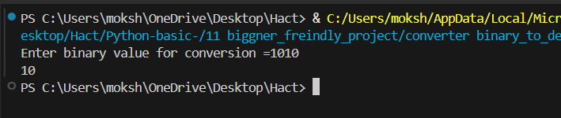
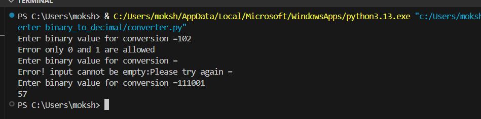

# Binary to Decimal Converter(Python)


A **beginner-friendly Python project** that converts binary numbers (containing only 0s and 1s) into their **decimal equivalent**.  
This project helps new programmers understand loops, conditionals, and input validation in Python.

---

## 📘 Overview

This simple converter:
- Takes binary input from the user.
- Validates that the input only contains `0` and `1`.
- Converts it into a **decimal number** using a custom logic (without built-in conversion).
- Displays helpful error messages for invalid inputs.

---

## ⚙️ Features

- Input validation (no empty strings, no invalid characters)  
- Repeated prompt until valid input is given  
- Step-by-step binary-to-decimal conversion  
- Beginner-friendly, clean code  
- Easy to test and understand  

---

## 🧠 Concepts Used

- `while True` loop for continuous input  
- Conditional checks (`if`, `continue`, `break`)  
- String reversal using `reversed()`  
- Power calculation using `2 ** n`  
- Type conversion with `int()`  

---

## 💻 Code

```
# Binary to Decimal Converter
# --------------------------------------------
Author: Saman Tariq
Description: Converts a binary number (0s and 1s) into decimal format.

while True:
    value=input("Enter binary value for conversion =").strip()
    if value=="":
        print("Error! input cannot be empty:Please try again =")
        continue
    if not all (digit in "01" for digit in value):
        print("Error only 0 and 1 are allowed")
        continue
    break


result = 0
power=0

for i in reversed(str(value)):
    result = result + (int(i) * 2**power)
    power+=1
    
print(result)

```

## 🧪 Example Runs



## ⚠️ Error Example


## 🧭 Purpose of This Code

The purpose of this project is to help beginners understand **how binary numbers are converted to decimal manually** without using Python’s built-in functions.  
It reinforces fundamental programming concepts like:
- Input handling and validation  
- Using loops for repeated tasks  
- Performing arithmetic operations (`2 ** power`)  
- Printing clear and user-friendly messages  

By contributing this project, you’ll learn how to write clean, interactive console programs while participating in **Hacktoberfest 2025** 🌍.

---

## 👨‍💻 Contributor

Mokshi Shah
Contributor for Hacktoberfest 2025 🎃
```
https://github.com/Mokshii46
```